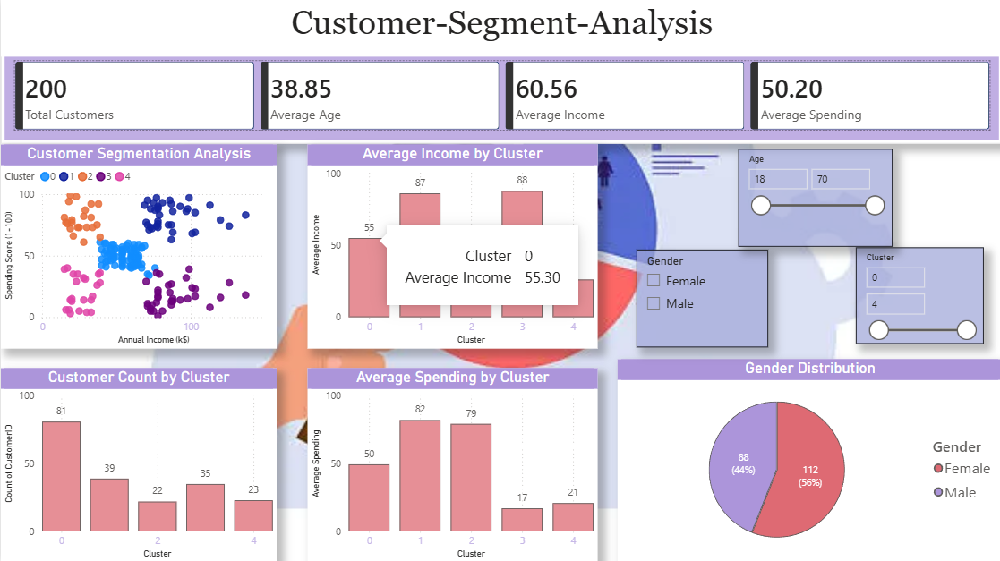

# Customer-Segment-Analysis<br>
## Project Overview

This project focuses on segmenting customers based on their purchasing behavior using Machine Learning (K-Means Clustering). The objective is to identify different customer groups and provide business insights that help organizations improve marketing strategies, customer retention, and sales performance.<br>

The project uses Python for data analysis and clustering and Power BI for interactive dashboard creation.<br>

---

# Objectives

- Analyze customer demographics and spending behavior.<br>
- Identify customer groups using K-Means Clustering.<br>
- Visualize customer segments.<br>
- Generate business recommendations for each segment.<br>
- Build an interactive Power BI dashboard.<br>

---

# Tools & Technologies Used

### Python Libraries

- Pandas<br>
- NumPy<br>
- Matplotlib<br>
- Seaborn<br>
- Scikit-Learn<br>

### Visualization Tool

- Power BI

### Dataset

- Mall Customers Dataset from Kaggle<br>

---

# Project Workflow

## Phase 1: Dataset Collection

Downloaded the Mall Customers dataset and loaded it into Python.

---
## Phase 2: Library Installation

Installed required libraries:

```
pip install pandas numpy matplotlib seaborn scikit-learn
```

---

## Phase 3: Import Libraries

```
from sklearn.cluster import KMeans
from sklearn.preprocessing import StandardScaler
```

---


## Phase 4: Data Inspection

Checked:

- Data types<br>
- Missing values<br>
- Summary statistics<br>

---

## Phase 5: Data Cleaning

Performed:

- Duplicate removal<br>
- Missing value checks<br>

```python
df.drop_duplicates(inplace=True)
```

---

## Phase 6: Exploratory Data Analysis (EDA)

Analyzed:

### Age Distribution

- Customer age patterns

### Income Distribution

- Annual income analysis

### Spending Score Distribution

- Spending behavior analysis

Created histograms and distribution charts.

---

## Phase 7: Feature Selection

Selected important variables for clustering.

```python
X = df[[
'Annual Income (k$)',
'Spending Score (1-100)'
]]
```

---

## Phase 8: Data Scaling

Standardized data before clustering.

```python
scaler = StandardScaler()

X_scaled = scaler.fit_transform(X)
```

---

## Phase 9: Elbow Method

Used Elbow Method to determine the optimal number of clusters.

```python
wcss = []

for i in range(1,11):
    kmeans = KMeans(
        n_clusters=i,
        random_state=42
    )

    kmeans.fit(X_scaled)
    wcss.append(kmeans.inertia_)
```

---

## Phase 10: Elbow Curve Visualization

Plotted Elbow Curve.

Observation:

- Optimal Clusters = 5

---

## Phase 11: K-Means Clustering

Applied K-Means Algorithm.

```python
kmeans = KMeans(
    n_clusters=5,
    random_state=42
)

clusters = kmeans.fit_predict(X_scaled)
```

---

## Phase 12: Cluster Assignment

Added Cluster column.

```python
df["Cluster"] = clusters
```
Calculated number of customers in each segment.

```python
df["Cluster"].value_counts()
```

---

## Phase 13: Customer Segmentation Visualization

## Phase 14: Business Insights

## Phase 15: Export Final Dataset

Saved clustered dataset.

```python
df.to_csv(
    "Customer_Segments.csv",
    index=False
)
```

Generated final dataset containing Cluster information.

---

## Phase 16: Power BI Dashboard Development

Imported Customer_Segments.csv into Power BI.

Created:

### KPI Cards

- Total Customers<br>
- Average Age<br>
- Average Income<br>
- Average Spending Score<br>
- 
### Visualizations<br>

#### Customer Segmentation Analysis<br>
#### Customer Count by Cluster<br>
#### Average Income by Cluster<br>
#### Average Spending by Cluster<br>
#### Gender Distribution<br>

### Slicers

- Gender<br>
- Cluster<br>
- Age<br>

---

# Key Findings

- Identified 5 unique customer segments.<br>
- High-income high-spending customers are the most valuable customers.<br>
- High-income low-spending customers represent growth opportunities.<br>
- Customer segmentation helps create targeted marketing campaigns.<br>
- Business decisions can be optimized using customer behavior analysis.<br>

---

# Business Benefits

- Improved Customer Retention<br>
- Better Marketing Strategies<br>
- Increased Revenue Opportunities<br>
- Customer Personalization<br>
- Data-Driven Decision Making<br>

---
## Dashboard Preview<br>

